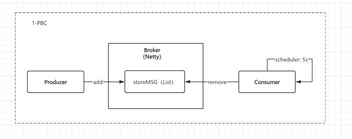
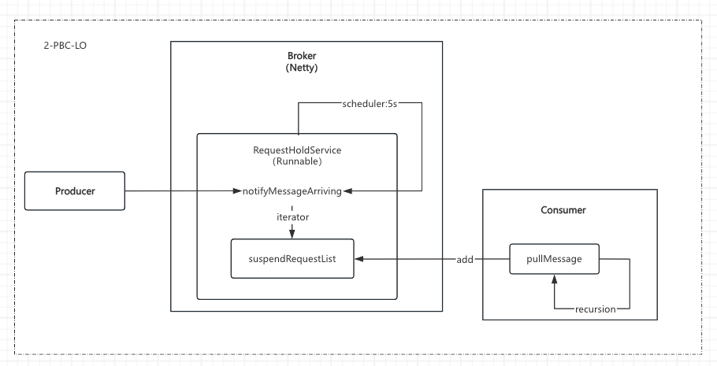
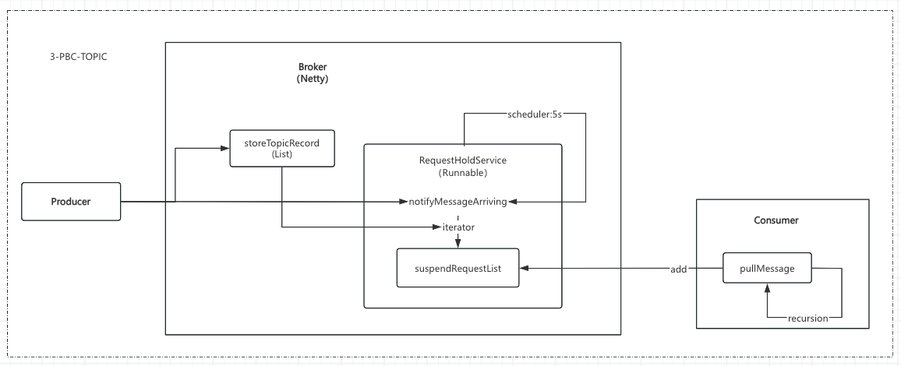
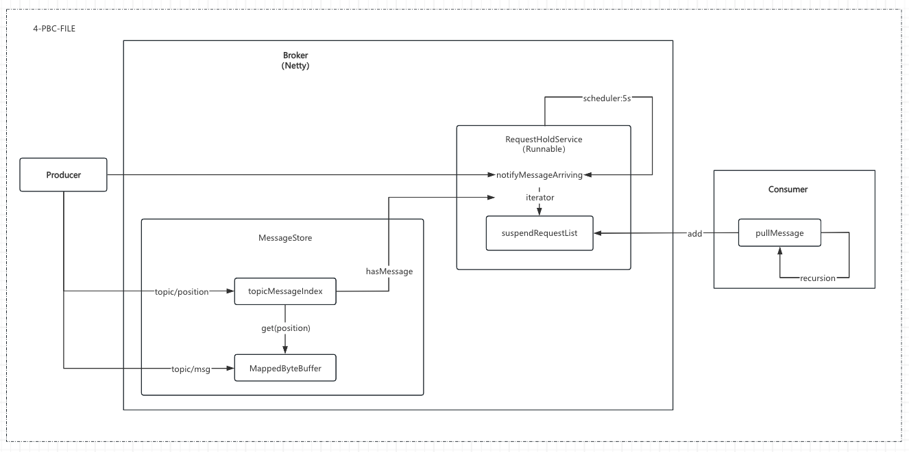
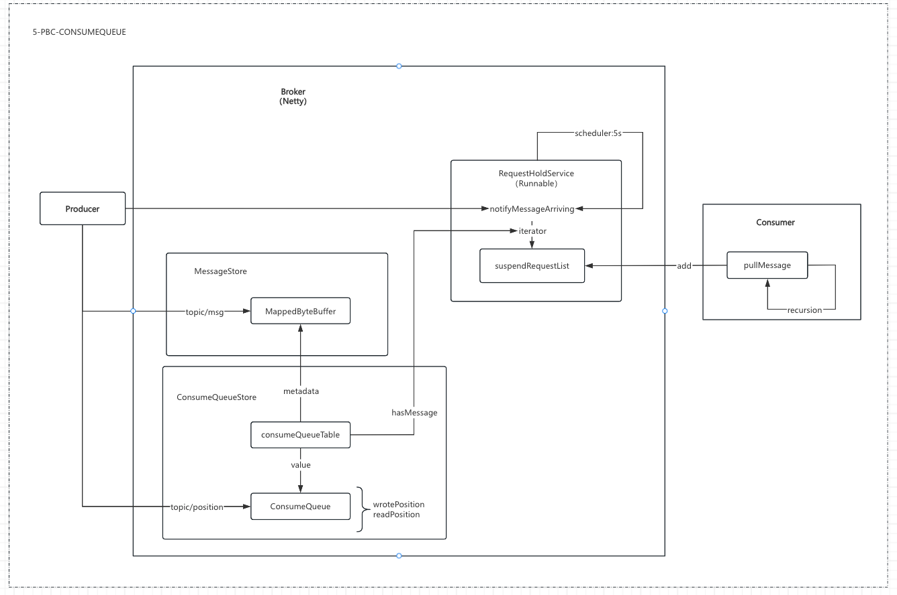
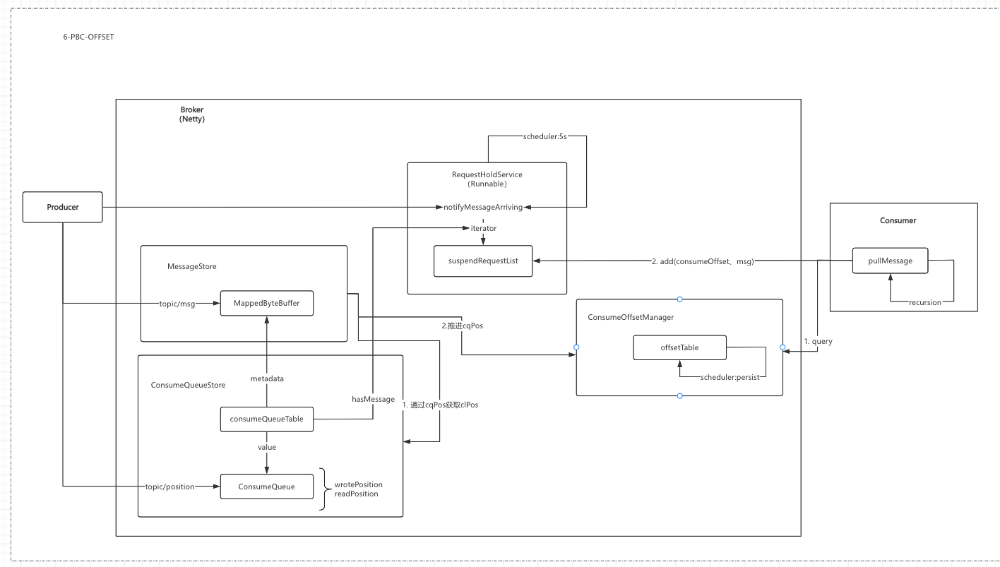
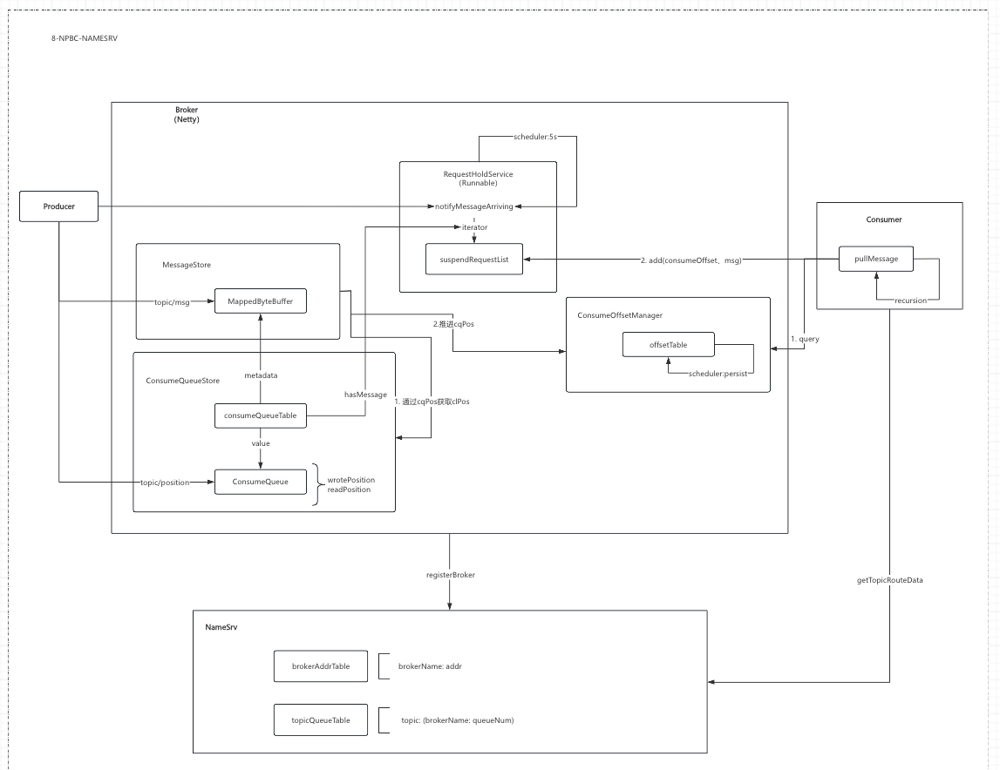
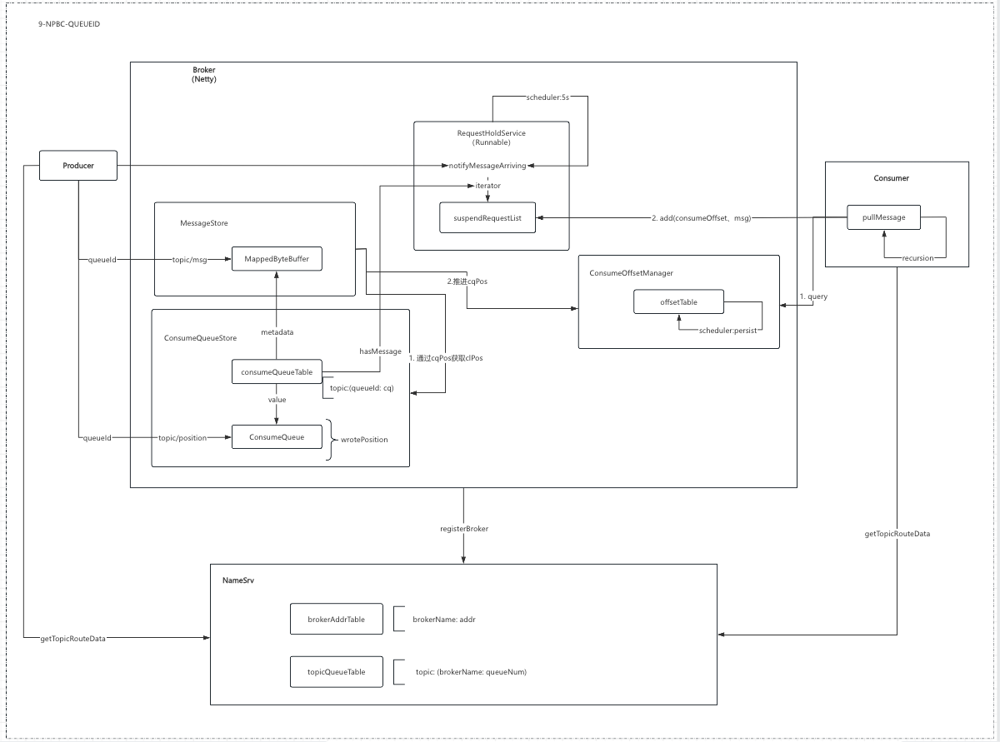

# rocketmq-destruction
- (1-PBC) broker: Local list stores JSON, consumer: Regular polling to pull messages;
- (2-PBC-LO) consumer, broker: Refactored to use long connections for receiving messages;
- (3-PBC-TOPIC) producer, consumer, broker: Introduced topics for multi-consumer management;
- (4-PBC-FILE) producer, consumer, broker: Changed to local file storage, updated to RocketMQ message protocol, introduced commitLog;
- (5-PBC-CONSUMEQUEUE) broker: Introduced consumeQueue;
- (6-PBC-OFFSET) consumer, broker: Consumption progress management;
- (7-PBC-TAG) broker: Introduced tags to add server-side message filtering;
- (8-NPBC-NAMESRV) nameserver: Introduced NameServer;
- (9-NPBC-QUEUEID) consumer: Refactored to use queueId;
- (10-NPBC-CONSUMERMODEL) consumer: Introduced consumer thread model;
- (11-NPBC-LB) producer, consumer: Introduced load balancing and rebalance mechanisms;
- (release_1-NPBC-ARCHITECTURE) Structural refactoring;
- (12-rNPBC-DELAY) Delayed messages;
- (13-rNPBC-PRETRY) Producer-side retry messages;
- (14-rNPBC-CRETRY) Consumer-side retry;
- (15-rNPBC-ORDER) Ordered messages;

Structural Refactoring
- broker: Implementation of transactional messages;
- broker: Introduction of message compression;

- broker: Local list stores obj, consumer: polls regularly to pull messages;
- consumer: Modify to long connection to get messages.
- broker: introduce topic. 
- broker: change to local file storage,modify to the message protocol of rocketmq, introduce commitLog.
- consumer: introduce consumer thread model, consumer schedule management、consumeQueue
- nameserver: introduce nameserver.
- producers and consumers: Introducing load balancing.
- producer and consumer: introduce message retry.
- broker: Implement server level message filtering.
- broker: Implement transaction messages.
- broker: Implement delay messages.
- broker: Introducing message compression.

The design of the message middleware revolves around two core issues:
- Storage Reliability
  - Messages stored in local memory are lost upon restart.
  - Writing to a DB introduces extra dependencies, effectively adding another potential point of failure.
  - Writing to local files requires solving three problems: IO efficiency, atomicity during writes, and recoverability after restart.
    - CommitLog, ConsumeQueue, IndexFile solve IO efficiency.
      - How does CommitLog record where the current message is written and where to start recovery after a failure?
        - StoreCheckPoint, abort files.
      - Consumption progress management.
    - MappedByteBuffer maps the CommitLog to solve atomicity during writes.
- Delivery Reliability
  Ensure at-least-once semantics.

### 1-PBC
Server-side:
- Messages are stored in local memory and easily lost during failures;
- To ensure consumption real-time performance, the polling frequency is high, leading to too much wasted effort on the server;
- All messages are mixed together, resulting in high maintenance costs;
- No horizontal scaling capability; cannot provide low-latency, high-reliability service when facing large volumes of message production and consumption;

Client-side:
- Eventually needs to reside inside a service; consumption uses timer-based polling, consuming too many host resources;
- Single-threaded serial production and consumption result in high latency and high resource consumption for large volumes of messages;
- Full pulls during consumption, unable to distinguish only the messages needed by the business.

### 2-PBC-LO
- Introduced a long-polling mechanism to solve the problem of excessive wasted effort.
A mechanism to notify of message arrival (RequestHoldService) is required, triggered under two scenarios: 1. Timer-based polling holds the request, 2. When a message is produced; both call the `notifyMessageArriving` method. When a consumption request arrives, the channel is inserted into `SuspendRequest`.

### 3-PBC-TOPIC
- Introduced topic dimensions for message classification to facilitate message maintenance.
Removed `storeMSG` (List) and used `storeTopicRecord` with topic as the key to store messages.

### 4-PBC-FILE
- Introduced local file storage for messages to solve the persistence problem.
Removed local `storeTopicRecord` storage and introduced `MessageStore` using `MappedByteBuffer` to map the `commitLog` file. Since all topics are mixed in the `commitLog` and consumption progress is not stored, `topicMessageIndex` was introduced to store the consumption progress under the topic; a progress element is inserted for every message produced.
Three methods are provided: `appendMessage` for storing messages, `consumeMessage` for consuming messages, and `hasMessage` for checking if there are messages under a topic.

### 5-PBC-CONSUMEQUEUE
- Removed `topicMessageIndex` and introduced `ConsumeQueueStore` to store message indexes separately by topic. New message arrivals are determined via the read and write pointers of the CQ.
Consumption progress was judged by the read/write pointer positions of the CQ; however, pointer positions were lost upon restart, causing message loss.
`hasMessage` is now provided by `ConsumeQueueStore`.

### 6-PBC-OFFSET
- Removed the CQ read position pointer and introduced `ConsumerOffsetManager` to manage consumption progress, corresponding to the `consumerOffset.json` file. In-service, this is mapped to a map and periodically synchronized back to the file.
The CO writes the corresponding `cqPosition` per topic and provides an interface for the consumer to query. When pulling messages, the `cqPosition` is included.

### 7-PBC-TAG
- Added `tag` to the properties of the message body to provide finer-grained management and prevent topic explosion.
An 8-byte `tagCode` was added to the CQ structure. The CO retains the topic structure; if the tag is not found in the CQ, the progress is still advanced normally.
Problem: Subscribing to the same topic with different tags shares a single consumption progress.

### 8-NPBC-NAMESRV
- Introduced `namesrv` using `brokerAddrTable` and `topicQueueTable` to manage broker registration requests and return information when the consumer needs to locate which broker to request.

### 9-NPBC-QUEUEID
- Introduced `queueId` on the broker side to improve horizontal scalability.
`queueId` is now written into the `commitLog` file. CQs are grouped in a second-level grouping by `queueId`, with the first level remaining as the topic.

- Introduced topic dimensions for message classification to facilitate message maintenance.
Removed `storeMSG` (List) and used `storeTopicRecord` with topic as the key to store messages.

### 4-PBC-FILE
- Introduced local file storage for messages to solve the persistence problem.
Removed local `storeTopicRecord` storage and introduced `MessageStore` using `MappedByteBuffer` to map the `commitLog` file. Since all topics are mixed in the `commitLog` and consumption progress is not stored, `topicMessageIndex` was introduced to store the consumption progress under the topic; a progress element is inserted for every message produced.
Three methods are provided: `appendMessage` for storing messages, `consumeMessage` for consuming messages, and `hasMessage` for checking if there are messages under a topic.

### 5-PBC-CONSUMEQUEUE
- Removed `topicMessageIndex` and introduced `ConsumeQueueStore` to store message indexes separately by topic. New message arrivals are determined via the read and write pointers of the CQ.
Consumption progress was judged by the read/write pointer positions of the CQ; however, pointer positions were lost upon restart, causing message loss.
`hasMessage` is now provided by `ConsumeQueueStore`.

### 6-PBC-OFFSET
- Removed the CQ read position pointer and introduced `ConsumerOffsetManager` to manage consumption progress, corresponding to the `consumerOffset.json` file. In-service, this is mapped to a map and periodically synchronized back to the file.
The CO writes the corresponding `cqPosition` per topic and provides an interface for the consumer to query. When pulling messages, the `cqPosition` is included.

### 7-PBC-TAG
- Added `tag` to the properties of the message body to provide finer-grained management and prevent topic explosion.
An 8-byte `tagCode` was added to the CQ structure. The CO retains the topic structure; if the tag is not found in the CQ, the progress is still advanced normally.
Problem: Subscribing to the same topic with different tags shares a single consumption progress.

### 8-NPBC-NAMESRV
- Introduced `namesrv` using `brokerAddrTable` and `topicQueueTable` to manage broker registration requests and return information when the consumer needs to locate which broker to request.

### 9-NPBC-QUEUEID
- Introduced `queueId` on the broker side to improve horizontal scalability.
`queueId` is now written into the `commitLog` file. CQs are grouped in a second-level grouping by `queueId`, with the first level remaining as the topic.

### 13-rNPBC-PRETRY
- Producer-side retry mechanism, similar to cache design, maintaining a table on the client.
- If `sendLatencyFaultEnable` (fault delay) is not enabled, avoid the broker that failed last time.
- If fault delay is enabled, dynamically calculate the avoidance time for previously failed brokers.
