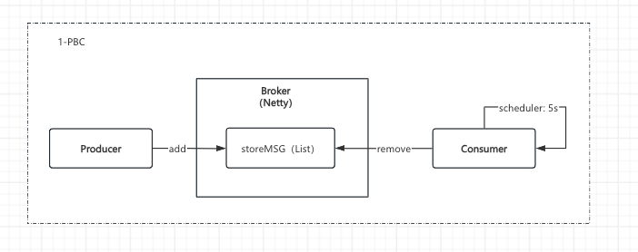

# rocketmq-destruction
- (1-PBC) broker:本地list存储JSON，consumer：定时轮询拉取消息；
- (2-PBC-LO) consumer、broker：改造为长连接获取消息
- (3-PBC-TOPIC) producer、consumer、broker：引入topic，多消费者管理
- (4-PBC-FILE) producer、consumer、broker：改为本地文件存储，修改为rocketmq的消息协议，引入commitLog
- (5-PBC-CONSUMEQUEUE) broker：引入consumeQueue
- (6-PBC-OFFSET) consumer、broker：消费进度管理
- (7-PBC-TAG) broker：引入tag，增加服务端消息过滤
- (8-NPBC-NAMESRV) nameserver：引入nameserver
- (9-NPBC-QUEUEID) consumer: 改造为queueId
- (10-NPBC-CONSUMERMODEL) consumer: 引入消费者线程模型
- (11-NPBC-LB)producer、consumer: 引入负载均衡、重平衡机制
- (release_1-NPBC-ARCHITECTURE) 结构改造
- (12-rNPBC-DELAY) 延迟消息
- (13-rNPBC-PRETRY) 生产端重试消息

结构化改造
- consumer：引入重试消息
- broker：顺序消息
- broker：实现事务消息
- broker：引入消息压缩

- broker: Local list stores obj, consumer: polls regularly to pull messages;
- consumer: Modify to long connection to get messages.
- broker: introduce topic. 
- broker: change to local file storage,modify to the message protocol of rocketmq, introduce commitLog.
- consumer: introduce consumer thread model, consumer schedule management、consumeQueue
- nameserver: introduce nameserver.
- producers and consumers: Introducing load balancing.
- producer and consumer: introduce message retry.
- broker: Implement server level message filtering.
- broker: Implement transaction messages.
- broker: Implement delay messages.
- broker: Introducing message compression.

消息中间件的设计，围绕两个核心问题展开
- 存储的可靠性
- 投递的可靠性
保证at-least-once语义

### 1-PBC
服务端：
- 消息存储在本地内存，故障易丢失；
- 为了保证消费实时性，消费轮询的频次足够密，服务端产生太多无用功；
- 所有的消息杂糅在一起，维护成本高；
- 无水平扩展能力，应对大批量的消息生产与消费时，无法提供低延时、高可靠的服务能力；

客户端：
- 最终需要寄生在服务内部，消费采用定时轮询，消耗太多宿主资源
- 单线程串行生产与消费，面对大批量消息，延时高资源消耗大
- 消费时全量拉取，无法区分仅业务所需的消息

### 2-PBC-LO
- 引入长轮询机制，解决大量无用功问题。
需要引入通报消息到达的机制（RequestHoldService），在两种情境下触发，1.定时轮询hold住的请求 2.产生消息时；底层都调用notifyMessageArriving方法，消费请求到达时，在SuspendRequest里塞入channel。

### 3-PBC-TOPIC# rocketmq-destruction
- (1-PBC) broker:本地list存储JSON，consumer：定时轮询拉取消息；
- (2-PBC-LO) consumer、broker：改造为长连接获取消息
- (3-PBC-TOPIC) producer、consumer、broker：引入topic，多消费者管理
- (4-PBC-FILE) producer、consumer、broker：改为本地文件存储，修改为rocketmq的消息协议，引入commitLog
- (5-PBC-CONSUMEQUEUE) broker：引入consumeQueue
- (6-PBC-OFFSET) consumer、broker：消费进度管理
- (7-PBC-TAG) broker：引入tag，增加服务端消息过滤
- (8-NPBC-NAMESRV) nameserver：引入nameserver
- (9-NPBC-QUEUEID) consumer: 改造为queueId
- (10-NPBC-CONSUMERMODEL) consumer: 引入消费者线程模型
- (11-NPBC-LB)producer、consumer: 引入负载均衡、重平衡机制
- (release_1-NPBC-ARCHITECTURE) 结构改造
- (12-rNPBC-DELAY) 延迟消息

结构化改造
- producer：消息重试
- consumer：引入重试消息
- broker：实现事务消息
- broker：引入消息压缩

- broker: Local list stores obj, consumer: polls regularly to pull messages;
- consumer: Modify to long connection to get messages.
- broker: introduce topic.
- broker: change to local file storage,modify to the message protocol of rocketmq, introduce commitLog.
- consumer: introduce consumer thread model, consumer schedule management、consumeQueue
- nameserver: introduce nameserver.
- producers and consumers: Introducing load balancing.
- producer and consumer: introduce message retry.
- broker: Implement server level message filtering.
- broker: Implement transaction messages.
- broker: Implement delay messages.
- broker: Introducing message compression.

消息中间件的设计，围绕两个核心问题展开
- 存储的可靠性
- 投递的可靠性
  保证at-least-once语义

### 1-PBC
服务端：
- 消息存储在本地内存，故障易丢失；
- 为了保证消费实时性，消费轮询的频次足够密，服务端产生太多无用功；
- 所有的消息杂糅在一起，维护成本高；
- 无水平扩展能力，应对大批量的消息生产与消费时，无法提供低延时、高可靠的服务能力；

客户端：
- 最终需要寄生在服务内部，消费采用定时轮询，消耗太多宿主资源
- 单线程串行生产与消费，面对大批量消息，延时高资源消耗大
- 消费时全量拉取，无法区分仅业务所需的消息
  

### 2-PBC-LO
- 引入长轮询机制，解决大量无用功问题。
  需要引入通报消息到达的机制（RequestHoldService），在两种情境下触发，1.定时轮询hold住的请求 2.产生消息时；底层都调用notifyMessageArriving方法，消费请求到达时，在SuspendRequest里塞入channel。
  

### 3-PBC-TOPIC
- 引入topic维度进行消息分类，方便维护消息
  移除storeMSG（List），使用key为topic的storeTopicRecord存储消息。
  

### 4-PBC-FILE
- 引入本地文件存储消息，解决消息无法持久化的问题
  移除storeTopicRecord本地存储，引入MessageStore使用MappedByteBuffer映射commitLog文件，由于所有topic混合存入commitLog，且不存储消费进度，需要引入topicMessageIndex，存储topic下的消费进度，生产一条消息插入一个进度元素。
  提供三个方法，存储消息appendMessage, 消费消息consumeMessage，查询topic下是否有消息 hasMessage
  

### 5-PBC-CONSUMEQUEUE
- 移除topicMessageIndex，引入ConsumeQueueStore按topic分别存储消息索引。且通过cq的已读已写指针，判断是否存在新消息到达。
  消费进度通过cq的读写指针位置判断，重启则丢失指针位置，造成消息丢失
  hasMessage改为由ConsumeQueueStore提供
  

### 6-PBC-OFFSET
- 移除cq读位置指针，引入ConsumerOffsetManager管理消费进度，对应consumerOffset.json文件，服务中映射为map，定时同步回文件。
  co按topic写入对应cqPosition，并提供接口供consumer查询，拉取消息时，带上cqPosition
  

### 7-PBC-TAG
- 在消息体的properties中新增tag，提供更细维度的管理，避免topic急剧膨胀
  cq结构中新增8字节的tagCode，co还是保持topic结构，若cq未找到还是正常推进进度。
  存在订阅同一个topic，不同tag，共享了一份消费进度问题。

### 8-NPBC-NAMESRV
- 引入namesrv使用brokerAddrTable和topicQueueTable管理broker注册请求，并在consumer定位请求哪个broker时返回
  

### 9-NPBC-QUEUEID
- broker端引入queueId，提高横向扩展能力。
  commitLog新增queueId存入文件，cq按queueId进行二级分组，一级依旧为topic
  

- 引入topic维度进行消息分类，方便维护消息
移除storeMSG（List），使用key为topic的storeTopicRecord存储消息。

### 4-PBC-FILE
- 引入本地文件存储消息，解决消息无法持久化的问题
移除storeTopicRecord本地存储，引入MessageStore使用MappedByteBuffer映射commitLog文件，由于所有topic混合存入commitLog，且不存储消费进度，需要引入topicMessageIndex，存储topic下的消费进度，生产一条消息插入一个进度元素。
提供三个方法，存储消息appendMessage, 消费消息consumeMessage，查询topic下是否有消息 hasMessage

### 5-PBC-CONSUMEQUEUE
- 移除topicMessageIndex，引入ConsumeQueueStore按topic分别存储消息索引。且通过cq的已读已写指针，判断是否存在新消息到达。
消费进度通过cq的读写指针位置判断，重启则丢失指针位置，造成消息丢失
hasMessage改为由ConsumeQueueStore提供

### 6-PBC-OFFSET
- 移除cq读位置指针，引入ConsumerOffsetManager管理消费进度，对应consumerOffset.json文件，服务中映射为map，定时同步回文件。
co按topic写入对应cqPosition，并提供接口供consumer查询，拉取消息时，带上cqPosition

### 7-PBC-TAG
- 在消息体的properties中新增tag，提供更细维度的管理，避免topic急剧膨胀
cq结构中新增8字节的tagCode，co还是保持topic结构，若cq未找到还是正常推进进度。
存在订阅同一个topic，不同tag，共享了一份消费进度问题。

### 8-NPBC-NAMESRV
- 引入namesrv使用brokerAddrTable和topicQueueTable管理broker注册请求，并在consumer定位请求哪个broker时返回

### 9-NPBC-QUEUEID
- broker端引入queueId，提高横向扩展能力。
commitLog新增queueId存入文件，cq按queueId进行二级分组，一级依旧为topic

